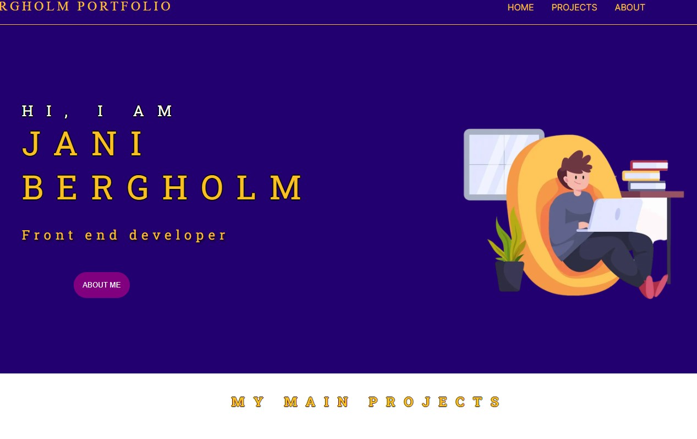

This is a [Next.js](https://nextjs.org/) project bootstrapped with [`create-next-app`](https://github.com/vercel/next.js/tree/canary/packages/create-next-app).

## My Portfolio webiste

Creating webiste using Next.js

- note: Plan was to create with React but as React dev sites offered to use Next.js -> lets do with that one. (1st time using)

# Plan:

- First get the Next.js working locally
- Then create a basic website structure
- Make it look better
- Add projects to front page (4-5 most important ones)
- Add projects to project page
- Add stuff to about page
