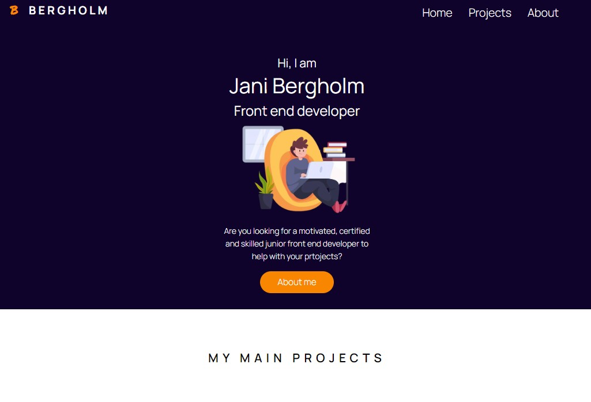

This is a [Next.js](https://nextjs.org/) project bootstrapped with [`create-next-app`](https://github.com/vercel/next.js/tree/canary/packages/create-next-app).

## My Portfolio webiste

- NEW LAYOUT and FRONT PAGE!

Creating webiste using Next.js

- note: Plan was to create with React but as React dev sites offered to use Next.js -> lets do with that one. (1st time using).

# About the functions:

- There is a file for the project information called card.info
- This info is then taken to cards and there is few rules that will check if the project should be added to the front page or not.
- Also in cards it will check if the project has a live page. If not then the live-page button will be removed.

- For the navbar there is a function that will display "hamburger menu" when on mobile and normal menu when on wider screens.

# Plan:

- Next step is to get the project image link to be removed if there is no livebage for the card.
